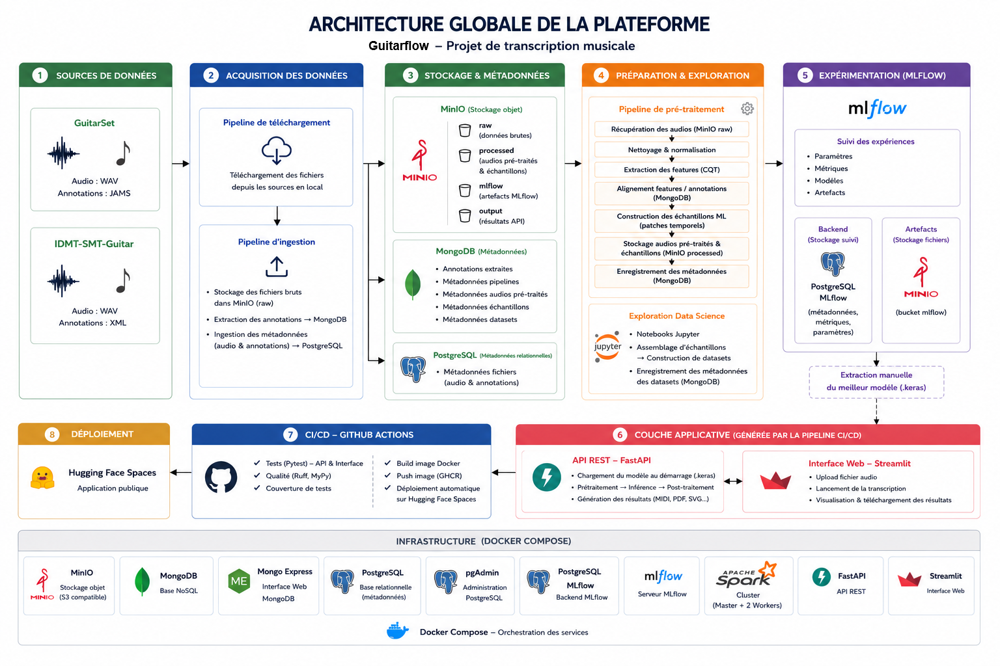

<h1>GuitarFlow - Transcription musicale automatique</h1>

> Transcription automatique d'un signal audio de guitare en représentation musicale (fichier MIDI et partition PDF) à l’aide de techniques de traitement du signal et d'apprentissage machine.
>
> Ce projet est réalisé dans le cadre du titre professionnel **RNCP 35288 – Concepteur Développeur en Science des Données**.

# 1. Table des matières

- [1. Table des matières](#1-table-des-matières)
- [2. Présentation](#2-présentation)
- [3. Objectifs du projet](#3-objectifs-du-projet)
- [4. Livrables pour le titre professionnel RNCP 35288](#4-livrables-pour-le-titre-professionnel-rncp-35288)
- [5. Architectures](#5-architectures)
  - [5.1. Architecture globale](#51-architecture-globale)
  - [5.2. Architecture de déploiement](#52-architecture-de-déploiement)
- [6. Organisation du dépôt](#6-organisation-du-dépôt)
- [7. Technologies utilisées](#7-technologies-utilisées)
- [Prérequis](#prérequis)
- [8. Démarrage rapide](#8-démarrage-rapide)
  - [8.1. Cloner le dépôt](#81-cloner-le-dépôt)
  - [8.2. Télécharger les dépendances](#82-télécharger-les-dépendances)
  - [8.3. Créer le fichier d'environnement](#83-créer-le-fichier-denvironnement)
  - [8.4. Démarrer l'infrastructure](#84-démarrer-linfrastructure)
- [9. Infrastructure Docker Compose](#9-infrastructure-docker-compose)
- [10. Déroulement complet du projet](#10-déroulement-complet-du-projet)
- [11. Construction des données](#11-construction-des-données)
  - [11.1. Télécharger les jeux de données](#111-télécharger-les-jeux-de-données)
  - [11.2. Ingérer les données](#112-ingérer-les-données)
  - [11.3. Prétraiter les données](#113-prétraiter-les-données)
  - [11.4. Construction des jeux d'entraînement](#114-construction-des-jeux-dentraînement)
- [12. Analyse exploratoire des données](#12-analyse-exploratoire-des-données)
- [13. Expérimentations Machine Learning](#13-expérimentations-machine-learning)
- [14. Couche applicative](#14-couche-applicative)
  - [14.1. API REST](#141-api-rest)
  - [14.2. Interface utilisateur](#142-interface-utilisateur)
  - [14.3. Déploiement](#143-déploiement)
  - [14.4. Intégration et livraison continues (CI/CD)](#144-intégration-et-livraison-continues-cicd)

# 2. Présentation

Ce projet a été réalisé dans le cadre d'un cas d'usage simulé, pour une entreprise fictive nommée *GuitarFlow*.

Le but est de concevoir une solution capable de convertir automatiquement un enregistrement audio de guitare en une représentation musicale exploitable, afin de réduire le temps nécessaire à la retranscription manuelle et de faciliter la production de contenus pédagogiques et musicaux.

Pour répondre à ce besoin, le projet couvre l'ensemble du cycle de vie d'un projet de Data Science :

- collecte et ingestion des données,
- stockage et gouvernance des données,
- analyse exploratoire des jeux de données,
- prétraitement des signaux audio,
- construction des jeux de données d'entraînement,
- expérimentation et comparaison de plusieurs modèles d'apprentissage automatique,
- suivi des expérimentations avec **MLflow**,
- industrialisation du modèle sélectionné,
- déploiement d'une API REST et d'une interface web.

La solution développée permet, à partir d'un fichier audio au format WAV, de générer automatiquement plusieurs artefacts exploitables :

- un fichier MIDI,
- une représentation Piano Roll (SVG et PNG),
- une partition musicale (SVG et PDF).

Pour plus de détails, se référer à la [note de cadrage](./livrables/gestion_de_projet/note_de_cadrage.pdf) et au [cahier des charges](./livrables/gestion_de_projet/cahier_des_charger.pdf).

# 3. Objectifs du projet

Ce projet poursuit un double objectif.

Le premier consiste à concevoir une plateforme de données reproductible permettant de collecter, stocker, transformer et préparer des données musicales pour l'apprentissage automatique. Cette plateforme doit garantir la qualité des jeux de données produits, assurer la traçabilité des traitements (data lineage) et faciliter l'expérimentation de plusieurs architectures de machine learning grâce au suivi des expériences avec **MLflow**.

Le second objectif est d'industrialiser le modèle sélectionné afin de le rendre exploitable par des utilisateurs au travers d'une API REST et d'une interface web, dans un environnement standardisé, reproductible et entièrement automatisé.

Pour répondre à ces objectifs, l'architecture du projet est organisée en deux couches complémentaires :

- une **plateforme Data**, dédiée à la collecte des données, aux pipelines ETL, au prétraitement des signaux audio, à la construction des jeux d'entraînement et aux expérimentations de modèles,
- une **couche applicative**, chargée du déploiement du modèle sélectionné au sein d'une API REST développée avec **FastAPI** et d'une interface utilisateur développée avec **Streamlit**.

Cette couche applicative est conteneurisée avec **Docker**, validée automatiquement par une chaîne **GitHub Actions**, puis déployée sur **Hugging Face Spaces**, garantissant une mise en production reproductible et continue.

# 4. Livrables pour le titre professionnel RNCP 35288

Ce dépôt regroupe les différents livrables demandés dans le cadre du titre professionnel **RNCP 35288 – Concepteur Développeur en Science des Données**.

Le fichier [`livrables.pdf`](./livrables.pdf) est constitué de liens pointant vers les différents livrables afin de faciliter la navigation dans le dépôt. Chaque livrable renvoie directement vers les parties correspondantes du code source afin de faciliter l'évaluation.

| Élément | Emplacement |
| :- | :- |
| Documentation Projet (livrables 1, 5 et 6) | [`livrables/`](./livrables/) |
| Documentation ETL | [`audio_midi/docs/`](./audio_midi/docs/) |
| Code ETL | [`audio_midi/src/`](./audio_midi/src/) |
| Notebooks (livrables 2, 3 et 4) | [`audio_midi/notebooks/`](./audio_midi/notebooks/) |
| Code API REST | [`api/backend/`](./api/backend/) |
| Code Interface web | [`api/frontend/`](./api/frontend/) |
| Tests API REST | [`api/tests/`](./api/tests/) |
| CI/CD | [`.github/workflow/cicd.yaml`](./.github/workflows/cicd.yaml) |
| Docker Compose | [`docker-compose.yaml`](./docker-compose.yml) |
| Dockerfile API REST | [`Dockerfile`](./Dockerfile) |

# 5. Architectures

## 5.1. Architecture globale

La figure ci-dessous présente l'architecture globale du projet. Elle met en évidence les différentes étapes du projet, depuis le téléchargement des jeux de données **GuitarSet** et **IDMT-SMT-Guitar** jusqu'au déploiement automatisé de l'application sur **Hugging Face Spaces**.



Pour une présentation en détails de l'architecturen se référer au [`livrable 1`](./livrables/livrable1_infrastructure_conceptualisee.pdf).

## 5.2. Architecture de déploiement

La figure ci-dessous présente l'architecture de déploiement. Elle met en évidence les étapes du processus de déploiement.


Pour une présentation en détails de l'architecturen se référer au [`livrable 5`](./livrables/livrable5_industrialisation.pdf).

# 6. Organisation du dépôt

Le dépôt est structuré afin de séparer clairement les différentes phases du projet : construction des données, expérimentation des modèles et industrialisation de la solution.

```text
.
├── .github/                # Pipeline CI/CD
│
├── api/                    # Couche applicative
│   ├── backend/            # API REST FastAPI
│   ├── frontend/           # Interface Streamlit
│   ├── tests/              # Tests unitaires et d'intégration
│   └── start.sh            # Démarrage simultané de FastAPI et Streamlit
│
├── audio_midi/             # Plateforme Data
│   ├── documentation/      # Documentation technique des pipelines
│   ├── notebooks/          # EDA, construction des datasets et expérimentations ML
│   ├── output/             # Résultats produits par les notebooks
│   ├── settings/           # Paramètres des pipelines
│   ├── src/
│   │   ├── downloaders/
│   │   ├── extractors/
│   │   ├── loaders/
│   │   ├── models/
│   │   ├── pipelines/
│   │   ├── storages/
│   │   ├── transformers/
│   │   └── utils/
│   └── main.py             # Interface en ligne de commande (CLI)
│
├── livrables/              # Livrables RNCP 35288
├── minio/                  # Initialisation de MinIO
├── mongo/                  # Scripts d'initialisation MongoDB
├── postgres/               # Scripts d'initialisation PostgreSQL
├── spark/                  # Environnement Spark (préparation de la V2)
│
├── docker-compose.yml
├── Dockerfile
├── pyproject.toml
└── uv.lock
```

# 7. Technologies utilisées

| Domaine | Technologies |
| :- | :- |
| API | **FastAPI** |
| Front | **Streamlit** |
| ML | **Scikit-learn** et **TensorFlow** |
| Expérimentations | **MLflow** |
| Data Lake | **MinIO** |
| Métadonnées | **MongoDB** |
| Base relationnelle | **PostgreSQL** |
| Big Data | **Apache Spark** (préparation de la V2) |
| CI/CD | **GitHub Actions** |
| Registry | **GHCR** |
| Déploiement | **Hugging Face Spaces** |
| Conteneurisation | **Docker** |
| Gestion Python | **uv** |

# Prérequis

- Git
- Docker et Docker Compose
- Python 3.13 (pour exécution locale)
- uv

# 8. Démarrage rapide

L'ensemble de la plateforme peut être lancé localement à l'aide de **Docker Compose**.

## 8.1. Cloner le dépôt

```bash
git clone https://github.com/DamienDESSAUX-M2i/M2i_CDSD_Projet.git

cd M2i_CDSD_Projet
```

## 8.2. Télécharger les dépendances

Le projet utilise le gestionnaire de dépendances **uv**. Pour l'installation d'**uv**, se référer à la documentation [https://docs.astral.sh/uv/getting-started/installation/](https://docs.astral.sh/uv/getting-started/installation/).

```bash
uv sync --group audio_midi --group api
```

## 8.3. Créer le fichier d'environnement

```bash
cp .env.example .env
```

Le fichier [`.env.example`](./.env.example) contient l'ensemble des variables nécessaires au fonctionnement de la plateforme.

## 8.4. Démarrer l'infrastructure

```bash
docker compose up -d
```

Après quelques instants, les différents services sont disponibles.

| Service | URL |
| :- | :- |
| API FastAPI | <http://localhost:8000> |
| Documentation OpenAPI | <http://localhost:8000/docs> |
| Interface Streamlit | <http://localhost:7860> |
| MLflow | <http://localhost:5000> |
| PgAdmin | <http://localhost:8080> |
| Mongo Express | <http://localhost:8081> |
| MinIO Console | <http://localhost:9001> |

# 9. Infrastructure Docker Compose

Le fichier [`docker-compose.yml`](./docker-compose.yml) déploie l'ensemble de la plateforme utilisée durant le projet.

| Service | Rôle |
| :- | :- |
| **MinIO** | Data Lake contenant les données brutes, prétraitées et les artefacts MLflow |
| **MongoDB** | Base documentaire stockant les annotations et les métadonnées des pipelines, des audios pré-traités, des échantillons et des jeux d'entraienement |
| **Mongo Express** | Administration de MongoDB |
| **PostgreSQL** | Métadonnées des fichiers audio et des annotations |
| **PgAdmin** | Administration PostgreSQL |
| **PostgreSQL MLflow** | Base relationnelle utilisée par MLflow |
| **MLflow** | Suivi des expérimentations de Machine Learning |
| **Spark** | Infrastructure distribuée prévue pour les futures versions des pipelines ETL |
| **API FastAPI** | Service de transcription automatique |
| **Interface Streamlit** | Interface utilisateur de démonstration |

# 10. Déroulement complet du projet

Le projet suis les étapes suivantes :

```text
01. Télécharger les données
        ↓
02. Ingérer les données
        ↓
03. Analyser les données
        ↓
04. Prétraiter les données
        ↓
05. Construire les jeux d'entraînement
        ↓
06. Analyser les jeux d'entraînement
        ↓
07. Expérimenter les modèles d'apprentissage machine
        ↓
08. Copier le meilleur modèle dans l'API
        ↓
09. Dockeriser la couche applicative
        ↓
10. CI/CD
        ↓
10. Déploiement Hugging Face
```

# 11. Construction des données

La préparation des données est réalisée indépendamment de l'API.

Elle suit quatre grandes étapes :

1. téléchargement des jeux de données,
2. ingestion des données dans le Data Lake,
3. prétraitement des fichiers audio,
4. construction des jeux de données d'entraînement,

Les différentes opérations sont pilotées depuis l'[interface en ligne de commande](./audio_midi/main.py).

## 11.1. Télécharger les jeux de données

Les jeux de données utilisés sont **GuitarSet** et **IDMT-SMT-Guitar**. Pour plus de détails sur ces jeux de données, se référer à l'[inventaire de données](./livrables/gestion_de_projet/inventaire_des_sources_de_donnees.pdf) et au [descriptif des données](./livrables/gestion_de_projet/descriptif_des_donnees.pdf).

Télécharger l'ensemble des datasets :

```bash
uv run audio_midi/main.py --download_datasets
```

Télécharger uniquement **GuitarSet** :

```bash
uv run audio_midi/main.py --download_datasets  --no_guitar_set
```

Télécharger uniquement **IDMT-SMT-Guitar** :

```bash
uv run audio_midi/main.py  --download_datasets  --no_idmt_smt_guitar
```

Les données téléchargées sont stockées localement avant leur ingestion dans la plateforme.

## 11.2. Ingérer les données

Les pipelines d'ingestion réalise notamment :

- le stockage des fichiers bruts dans **MinIO**,
- l'extraction des annotations dans **MongoDB**,
- l'extraction des métadonnées dans **PostgreSQL**.

Ingérer **GuitarSet** :

```bash
uv run main.py --ingest_guitar_set
```

Ingérer **IDMT-SMT-Guitar** :

```bash
uv run main.py --ingest_idmt_smt_guitar
```

IDMT-SMT-Guitar regroupe quatre jeux de données nommés dataset1, dataset2, dataset3 et dataset4. Il est possible de désactiver l'ingestion d'un ou plusieurs jeux de données :

```bash
uv run main.py --ingest_idmt_smt_guitar --no_dataset1 --no_dataset4
```

Limiter l'ingestion :

Pour accélérer les démonstrations, il est possible de limiter le nombre de fichiers traités.

```bash
uv run main.py --ingest_guitar_set --limit 20
```

## 11.3. Prétraiter les données

Le pipeline de prétraitement réalise notamment :

- le nettoyage des signaux audio,
- la normalisation des amplitudes,
- l'extraction des caractéristiques acoustiques,
- l'alignement avec les annotations,
- la construction des échantillons destinés à l'entraînement.

L'ensemble des données produites est stocké dans le bucket `processed` de **MinIO** tandis que les métadonnées des traitements sont enregistrées dans **MongoDB**.

Prétraiter les données :

```bash
python main.py --preprocess_datasets
```

Prétraiter un jeu de données spécifique :

```bash
# GuitarSet uniquement
python main.py --preprocess_datasets --ingest_guitar_set

# IDMT-SMT-Guitar uniquement
python main.py --preprocess_datasets --ingest_idmt_smt_guitar

# dataset2 et dataset3 de IDMT-SQM-Guitar uniquement
python main.py --preprocess_datasets --ingest_idmt_smt_guitar --no_dataset1 --no_dataset4
```

Limiter le nombre d'audio :

```bash
python main.py --preprocess_datasets --limit 20
```

## 11.4. Construction des jeux d'entraînement

La création des jeux de données d'entraînement est réalisée au travers de notebooks présents dans [`audio_midi/notebooks/`](./audio_midi/notebooks/).

Ces notebooks assemblent les samples issus du bucket `processed` de **MinIO**, enregistrent les métadonnées des datasets dans **MongoDB** et mènent les expérimentation des modèles de machine learning.

# 12. Analyse exploratoire des données

Avant la phase de modélisation, plusieurs analyses exploratoires ont été réalisées afin de comprendre les caractéristiques des données, de vérifier leur qualité et de guider les choix de prétraitement.

Trois études sont disponibles dans le dossier [`audio_midi/notebooks/`](./audio_midi/notebooks/) :

| Notebook | Objectif |
| :- | :- |
| [GuitarSet EDA](./audio_midi/notebooks/21_eda_guitarset.ipynb) | Analyse du dataset GuitarSet |
| [IDMT-SMT-Guitar EDA](./audio_midi/notebooks/22_eda_idmt_smt_guitar.ipynb) | Analyse du dataset IDMT-SMT-Guitar |
| [Dataset Frame-Wise EDA](./audio_midi/notebooks/23_eda_dataset_frame_wise.ipynb) | Analyse du jeu d'entraînement généré |

Ces notebooks présentent notamment :

- statistiques descriptives,
- analyses univariées,
- analyses multivariées,
- visualisations avec **Matplotlib** et **Seaborn**,
- contrôle de la qualité des données,
- vérification des distributions,
- analyse des déséquilibres éventuels,
- interprétation des résultats en vue de la modélisation.

# 13. Expérimentations Machine Learning

Les expérimentations sont également réalisées dans les notebooks Jupyter.

Plusieurs familles de modèles ont été évaluées au cours du projet, notamment :

| Notebook | Modèle |
| :- | :- |
| [CQT Baseline](./audio_midi/notebooks/31_cqt_baseline_trainer.ipynb) | One-vs-Rest + HistGradientBoosting |
| [CQT MLP](./audio_midi/notebooks/41_cqt_mlp_trainer.ipynb) | MLP |
| [CQT Context Window](./audio_midi/notebooks/42_cqt_rcnn_trainer.ipynb) | CNN + MLP et RCNN |

Toutes les expérimentations sont suivies avec **MLflow**, qui assure la traçabilité :

- des paramètres d'entraînement,
- des métriques,
- des artefacts produits,
- des modèles sauvegardés.

Les métadonnées MLflow sont stockées dans **PostgreSQL**, tandis que les artefacts (modèles, figures, fichiers associés) sont conservés dans le bucket `mlflow` de **MinIO**.

Le modèle sélectionné est ensuite exporté manuellement au format **TensorFlow** `.keras` et intégré à la couche applicative pour son déploiement.

# 14. Couche applicative

## 14.1. API REST

L'application expose une API REST développée avec **FastAPI** permettant d'exécuter le pipeline complet de transcription musicale.

Les principales fonctionnalités sont :

- vérification de l'état de l'application (`/health`),
- consultation des informations du modèle (`/model`),
- transcription d'un fichier audio WAV (`/predict`),
- téléchargement des artefacts générés (MIDI, piano-roll, partition).

Une documentation OpenAPI est disponible à l'adresse <http://localhost:8000/docs> après lancement de l'infrastructure.

Pour plus de détails sur l'architecture de l'API, consulter le [Livrable 5](./livrables/livrable5_industrialisation.pdf).

## 14.2. Interface utilisateur

Une interface **Streamlit** permet d'utiliser le modèle sans connaissance technique.

Elle permet :

- d'importer un fichier WAV,
- de lancer la transcription,
- de visualiser les résultats,
- de télécharger les fichiers générés.

Après le lancement de l'infrastructure :

Interface : <http://localhost:7860>
API : <http://localhost:8000>

## 14.3. Déploiement

La couche applicative est entièrement conteneurisée avec **Docker** et peut être exécutée en développement local via docker compose, ou automatiquement sur Hugging Face Spaces.

Application déployée : <https://huggingface.co/spaces/DamienDESSAUX/M2i_CDSD_Projet_Deployment>

La stratégie de déploiement, la conteneurisation et l'environnement standardisé sont décrits dans le [Livrable 5](./livrables/livrable5_industrialisation.pdf).

## 14.4. Intégration et livraison continues (CI/CD)

Le projet utilise **GitHub Actions** pour automatiser :

- les tests unitaires et d'intégration,
- l'analyse statique (Ruff, MyPy),
- la mesure de la couverture de tests,
- la construction de l'image Docker,
- la publication sur GitHub Container Registry (GHCR),
- le déploiement automatique sur Hugging Face Spaces.

L'architecture de la chaîne CI/CD est détaillée dans le [Livrable 5](./livrables/livrable5_industrialisation.pdf).

---

**Auteur :** Damien DESSAUX
