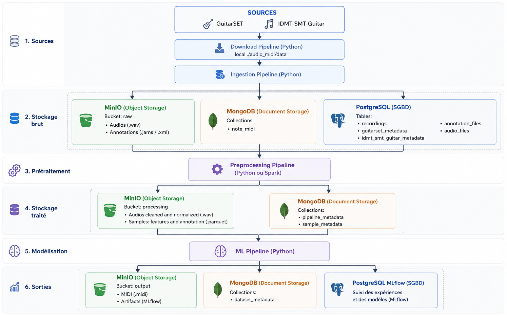

<h1>Livrable 1</h1>

# 1. Table des matières
- [1. Table des matières](#1-table-des-matières)
- [2. Contexte et problématique](#2-contexte-et-problématique)
  - [2.1. Contexte](#21-contexte)
  - [2.2. Problématique](#22-problématique)
  - [2.3. Objectifs de l'infrastructure](#23-objectifs-de-linfrastructure)
- [3. Analyse des besoins et des contraintes](#3-analyse-des-besoins-et-des-contraintes)
  - [3.1. Besoins fonctionnels](#31-besoins-fonctionnels)
  - [3.2. Contraintes techniques](#32-contraintes-techniques)
- [4. Principes d'architecture retenus](#4-principes-darchitecture-retenus)
  - [4.1. Une architecture organisée autour du cycle de vie de la donnée](#41-une-architecture-organisée-autour-du-cycle-de-vie-de-la-donnée)
- [5. Architecture globale de la plateforme](#5-architecture-globale-de-la-plateforme)
- [6. Description détaillée des composants](#6-description-détaillée-des-composants)
  - [6.1. MinIO : stockage objet](#61-minio--stockage-objet)
  - [6.2. MongoDB : gestion des métadonnées](#62-mongodb--gestion-des-métadonnées)
  - [6.3. PostgreSQL](#63-postgresql)
  - [6.4. MLflow](#64-mlflow)
  - [6.5. Pipelines ETL](#65-pipelines-etl)
  - [6.6. Cluster Apache Spark](#66-cluster-apache-spark)
  - [6.7. API FastAPI](#67-api-fastapi)
  - [6.8. Interface utilisateur Streamlit](#68-interface-utilisateur-streamlit)
  - [6.9. Docker Compose](#69-docker-compose)

# 2. Contexte et problématique
## 2.1. Contexte

La transcription automatique de musique (Automatic Music Transcription – AMT) consiste à convertir un signal audio en une représentation musicale exploitable, telle qu'une partition ou un fichier MIDI. Cette problématique mobilise plusieurs disciplines complémentaires, notamment le traitement du signal, le traitement et l'analyse des données et l'analyse musicale.

Le projet présenté dans ce dossier a pour objectif de développer une solution capable de transcrire automatiquement un enregistrement de guitare monophonique ou polyphonique en fichier MIDI et partition. La qualité d'un tel système repose autant sur les performances du modèle de Machine Learning que sur la maîtrise de l'ensemble du cycle de vie des données ayant permis son apprentissage.

La conception d'un système de transcription ne se limite donc pas au développement d'un modèle prédictif. Elle nécessite la mise en place d'une infrastructure capable de collecter, stocker, transformer et tracer les données utilisées pour l'entraînement, tout en garantissant la reproductibilité des expérimentations et le déploiement maîtrisé du modèle retenu.

Dans ce contexte, une architecture globale a été conçue afin de couvrir l'ensemble des besoins du projet, depuis la préparation des données jusqu'à l'exploitation du modèle au travers d'une application web.

## 2.2. Problématique

Le développement d'un projet de Data Science présente plusieurs défis techniques.

Les données d'apprentissage proviennent de sources hétérogènes et sont constituées de fichiers audio, d'annotations musicales et de métadonnées associées. Leur préparation nécessite plusieurs étapes de traitement successives (prétraitement audio, extraction de caractéristiques, alignement des annotations et construction des jeux de données d'entraînement), dont les résultats doivent rester reproductibles dans le temps.

Par ailleurs, les expérimentations menées durant la phase de recherche conduisent à entraîner plusieurs modèles de Machine Learning utilisant des architectures différentes. Il devient alors indispensable de conserver l'ensemble des paramètres, métriques et artefacts produits afin de comparer objectivement les performances obtenues et de sélectionner le modèle le plus pertinent.

Enfin, le modèle retenu doit pouvoir être intégré dans une application permettant aux utilisateurs de soumettre un fichier audio et d'obtenir automatiquement les résultats de la transcription. Cette dernière étape implique de disposer d'une infrastructure de déploiement garantissant la portabilité de l'application, la reproductibilité de son environnement d'exécution et l'automatisation des opérations de validation et de mise en production.

La problématique peut ainsi être formulée de la manière suivante :

> Comment concevoir une infrastructure de données reproductible, évolutive et industrialisable permettant de gérer l'ensemble du cycle de vie d'un projet de Machine Learning, depuis la préparation des données jusqu'au déploiement d'un modèle de transcription musicale ?

## 2.3. Objectifs de l'infrastructure

Afin de répondre à cette problématique, l'infrastructure conçue poursuit plusieurs objectifs complémentaires :

* centraliser le stockage des données brutes, des jeux de données construits, des modèles et des artefacts de traitement ;
* assurer la traçabilité des jeux de données et des pipelines de prétraitement afin de garantir la reproductibilité des expérimentations ;
* faciliter l'entraînement, la comparaison et le versionnement des modèles de Machine Learning grâce à une plateforme dédiée au suivi des expérimentations ;
* standardiser l'environnement de développement afin de garantir des conditions d'exécution identiques entre les différents environnements (développement, intégration continue et production) ;
* automatiser les opérations de validation, de construction et de déploiement au moyen d'une chaîne d'intégration et de déploiement continus (CI/CD) ;
* proposer une architecture modulaire permettant de faire évoluer les traitements de préparation des données, notamment par l'intégration future d'un moteur de calcul distribué tel qu'Apache Spark, sans remettre en cause l'organisation globale de la plateforme.

L'ensemble de ces objectifs a conduit à concevoir une architecture reposant sur des composants spécialisés, orchestrés par Docker Compose et entièrement décrits sous forme de code (Infrastructure as Code), afin de garantir la reproductibilité, la maintenabilité et l'évolutivité de la solution.

# 3. Analyse des besoins et des contraintes

L'objectif du projet est de concevoir une infrastructure complète permettant de développer, entraîner, évaluer puis déployer un modèle d'intelligence artificielle capable de transcrire automatiquement un enregistrement audio de guitare monophonique ou polyphonique en partition musicale (MIDI et partition PDF). Cette infrastructure doit couvrir l'ensemble du cycle de vie de la donnée et du modèle, depuis l'acquisition des données jusqu'à la mise à disposition d'une application exploitable par un utilisateur final.

L'analyse des besoins a conduit à distinguer deux usages principaux :

* un environnement de développement et d'expérimentation destiné au data scientist pour construire les jeux de données, entraîner plusieurs modèles et comparer leurs performances ;
* un environnement de déploiement permettant d'exposer le modèle retenu au travers d'une API REST et d'une interface web.

## 3.1. Besoins fonctionnels

L'infrastructure doit permettre de :

* centraliser les jeux de données audio et leurs annotations ;
* assurer la traçabilité des traitements appliqués aux données ;
* construire plusieurs versions de jeux d'entraînement à partir de pipelines de prétraitement ;
* expérimenter plusieurs architectures de modèles de deep learning ;
* assurer le suivi des expérimentations (paramètres, métriques, modèles et artefacts) ;
* charger le modèle retenu dans une API REST ;
* proposer une interface web simple permettant de déposer un fichier audio et de récupérer la transcription générée ;
* automatiser les contrôles qualité et le déploiement de l'application.

## 3.2. Contraintes techniques

Plusieurs contraintes ont orienté les choix d'architecture.

**Reproductibilité**

L'ensemble des environnements Python est géré avec uv, garantissant une installation déterministe des dépendances grâce au fichier uv.lock. Cette approche permet de reconstruire exactement le même environnement.

**Conteneurisation**

Tous les composants de la plateforme sont exécutés dans des conteneurs Docker orchestrés par Docker Compose. Cette approche permet :

* d'isoler les différents services ;
* de simplifier le déploiement ;
* d'obtenir un environnement identique en développement et en démonstration.

On peut ainsi reconstruire l'intégralité de l'infrastructure à partir d'une simple commande : `docker compose up -d`.

**Séparation des responsabilités**
 
L'architecture a été volontairement découpée en composants indépendants :

* stockage objet (MinIO) ;
* bases de données métier (MongoDB et PostgreSQL) ;
* suivi des expérimentations (MLflow) ;
* API d'inférence (FastAPI) ;
* interface utilisateur (Streamlit).

Cette séparation facilite la maintenance et permet de faire évoluer chaque composant indépendamment.

**Traçabilité des données**

L'infrastructure doit permettre de connaître précisément :

* l'origine d'un fichier audio ;
* le pipeline de prétraitement appliqué ;
* les jeux de données auxquels appartient chaque échantillon ;
* les modèles ayant été entraînés avec ces données.

Cette traçabilité est assurée conjointement par MongoDB, MinIO et MLflow.

**Industrialisation**

L'ensemble du code est versionné sous GitHub.
L'API d'inférence et l'interface utilisateur sont également contrôlées automatiquement via une chaîne CI/CD comprenant :

* l'exécution des tests unitaires et d'intégration ;
* le contrôle qualité avec Ruff ;
* la vérification statique avec MyPy ;
* la construction d'une image Docker ;
* la publication de cette image dans GitHub Container Registry ;
* le déploiement automatique sur Hugging Face Spaces.

Cette automatisation garantit que seule une version validée du projet peut être déployée.

**Évolutivité**

L'architecture a été pensée pour évoluer.
Ainsi, bien que les pipelines ETL soient actuellement développés en Python, un cluster Spark est déjà intégré à l'infrastructure. Il permettra, dans une future version du projet, de distribuer les traitements de prétraitement audio sur plusieurs nœuds sans modifier l'organisation générale de la plateforme.

# 4. Principes d'architecture retenus

L'infrastructure a été conçue selon une architecture modulaire distinguant clairement les différentes étapes du cycle de vie d'un projet de science des données : collecte des données, préparation des jeux d'entraînement, expérimentation des modèles, déploiement et exploitation. Cette séparation permet de faire évoluer chaque composant indépendamment tout en garantissant la reproductibilité des traitements.

## 4.1. Une architecture organisée autour du cycle de vie de la donnée

L'architecture s'articule autour de cinq couches fonctionnelles.

**Acquisition et stockage des données**

Les données sources (enregistrements audio et annotations musicales) sont stockées dans MinIO, utilisé comme stockage objet compatible S3. Les fichiers sont organisés dans plusieurs buckets correspondant aux différentes étapes du projet :

raw : données brutes (audios et annotations) ;
processed : données prétraitées, caractéristiques audio (features) et annotations alignées ;
output : réservé aux futures productions de l'API ;
mlflow : stockage des artefacts générés par MLflow (modèles, figures, métriques, etc.).

Cette organisation permet de conserver l'historique complet des transformations appliquées aux données tout en évitant la duplication des fichiers.

En parallèle, MongoDB stocke les métadonnées décrivant les pipelines de traitement. Chaque objet manipulé (audio, dataset ou pipeline) possède ainsi une description permettant de garantir la traçabilité des traitements réalisés.

**Construction des jeux d'entraînement**

Les pipelines ETL sont actuellement développés en Python. Ils réalisent successivement :

* la collecte des données (téléchargement des datasets GuitarSet et IDMT-SMT-Guitar)
* la normalisation et le nettoyage des enregistrements audio ;
* l'extraction des représentations fréquentielles (Constant-Q Transform, ...) ;
* l'alignement des annotations musicales ;
* la génération des jeux d'entraînement.

Les informations produites sont enregistrées dans MongoDB tandis que les fichiers générés sont stockés dans MinIO.

L'infrastructure intègre également un cluster Apache Spark composé d'un nœud maître et de deux nœuds de calcul. Cette partie n'est pas encore exploitée dans la version actuelle mais constitue une évolution prévue afin de distribuer les traitements de prétraitement lorsque les volumes de données deviendront plus importants.

**Expérimentation des modèles**

Les expérimentations sont réalisées avec MLflow.

Chaque entraînement enregistre automatiquement :

* l'identité du dataset utilisé ;
* les paramètres d'apprentissage ;
* les métriques d'évaluation ;
* les modèles entraînés ;
* les graphiques produits durant les expérimentations.

MLflow s'appuie sur deux composants complémentaires :

* PostgreSQL, utilisé comme base de données du serveur MLflow ;
* MinIO, utilisé pour conserver les artefacts (modèles TensorFlow, figures, jeux de paramètres...).

Cette architecture garantit la reproductibilité complète des expérimentations et facilite la comparaison entre plusieurs versions de modèles.

**Déploiement du modèle**

Le modèle retenu est exporté depuis MLflow sous la forme d'un modèle TensorFlow (.keras) puis intégré au dépôt Git.

Lors du démarrage de l'API, un ModelManager charge automatiquement :

* le modèle TensorFlow ;
* le scaler utilisé lors de l'entraînement ;
* les métadonnées décrivant le modèle.

Le modèle est ainsi chargé une seule fois au démarrage de l'application puis partagé entre toutes les requêtes, ce qui limite fortement le temps de réponse de l'API.

**Exposition du service**

La couche d'exploitation repose sur deux composants complémentaires :

* une API REST FastAPI qui expose les services de prédiction ;
* une application Streamlit constituant l'interface utilisateur.

Lorsqu'un utilisateur dépose un fichier audio, la requête suit le pipeline suivant :

* réception du fichier par Streamlit ;
* envoi à l'API REST ;
* prétraitement audio ;
* inférence par le modèle TensorFlow ;
* post-traitement musical ;
* génération des fichiers MIDI, SVG et PDF ;
* restitution des résultats à l'utilisateur.

Cette séparation entre interface graphique et logique métier facilite les évolutions futures et permet à d'autres applications de consommer directement l'API.

**Une architecture orientée microservices**

L'ensemble des composants est exécuté dans des conteneurs Docker indépendants orchestrés par Docker Compose.

Chaque service possède une responsabilité unique :

| Service | Rôle |
| :- | :- |
| MinIO | Stockage objet des données et des artefacts |
| MongoDB | Métadonnées des pipelines et des datasets |
| PostgreSQL | Données métier |
| PostgreSQL MLflow | Base de données des expérimentations MLflow |
| MLflow | Gestion des expériences de machine learning |
| API FastAPI | Inférence et orchestration des traitements |
| Streamlit | Interface utilisateur |
| Spark | Prétraitement distribué (évolution prévue) |

Cette organisation limite le couplage entre les composants et facilite leur maintenance ou leur remplacement.

**Reproductibilité et industrialisation**

La reproductibilité constitue un principe central de l'architecture.

L'environnement Python est standardisé avec uv, qui garantit des versions identiques des dépendances grâce au fichier uv.lock.

L'ensemble des services est défini dans un unique fichier docker-compose.yml, permettant de reconstruire automatiquement la plateforme complète.

Enfin, une chaîne CI/CD GitHub Actions automatise pour l'API d'inérence et l'interface utilisateur :

* l'exécution des tests unitaires et d'intégration ;
* la mesure de la couverture de code ;
* l'analyse statique avec Ruff et MyPy ;
* la construction de l'image Docker ;
* la publication de cette image sur GitHub Container Registry ;
* le déploiement automatique sur Hugging Face Spaces.

Cette automatisation garantit qu'une version déployée a systématiquement satisfait les contrôles qualité définis pour le projet.

**Justification des choix d'architecture**

Les choix retenus répondent aux objectifs identifiés lors de l'analyse des besoins :

* modularité, grâce à la séparation des responsabilités entre les services ;
* traçabilité, grâce à la combinaison de MongoDB, MinIO et MLflow ;
* reproductibilité, assurée par uv, Docker et GitHub Actions ;
* maintenabilité, par une architecture logicielle clairement découpée ;
* évolutivité, grâce à l'intégration anticipée d'un cluster Spark et à la séparation entre entraînement et inférence.

# 5. Architecture globale de la plateforme

La figure suivante présente l'architecture globale de la plateforme développée dans le cadre du projet.

L'infrastructure est organisée autour de plusieurs couches fonctionnelles couvrant l'ensemble du cycle de vie d'un projet de science des données, depuis l'acquisition des données jusqu'au déploiement du modèle auprès des utilisateurs.

**Sources de données**

Les données utilisées pour entraîner les modèles sont constituées de fichiers audio et de leurs annotations musicales. Elles sont importées dans la plateforme puis stockées dans MinIO, qui joue le rôle de stockage objet compatible Amazon S3.

Les objets sont répartis dans plusieurs buckets correspondant aux différentes étapes du traitement :

* raw : données brutes (enregistrements audio et annotations) ;
* processed : données prétraitées, caractéristiques audio et jeux d'entraînement ;
* mlflow : artefacts produits lors des expérimentations ;
* output : espace réservé aux productions futures de l'API.

Cette organisation permet de conserver chaque étape de transformation des données sans altérer les données d'origine.

**Gestion des métadonnées**

Les informations décrivant les jeux de données et les traitements réalisés sont stockées dans MongoDB et PostgreSQL.

La base de données PostgreSQL conserve :

* Les métadonnées des fichiers audios collectés.

La base de données MongoDB conserve :

* les métadonnées des fichiers audio pré-traités ;
* les métadonnées de représentations fréquentielles extraites ;
* les pipelines de prétraitement appliqués ;
* la composition des jeux d'entraînement.

Cette couche garantit la traçabilité complète des traitements réalisés sur les données.

**Préparation des données**

Les pipelines ETL sont développés en Python et assurent la préparation des données destinées à l'entraînement.

Ils réalisent successivement :

* la collecte et l'ingestion des données ;
* le prétraitement des signaux audio ;
* l'extraction des caractéristiques (features) ;
* l'alignement des annotations musicales ;
* la constitution des jeux d'entraînement ;
* les références vers les objets stockés dans MinIO.

Les résultats produits sont stockés simultanément dans MinIO et référencés dans MongoDB.

L'architecture prévoit également l'intégration d'un cluster Apache Spark afin de distribuer ces traitements sur plusieurs nœuds lors d'une évolution future de la plateforme.

**Expérimentation des modèles**

L'entraînement et l'évaluation des modèles sont réalisés avec MLflow.

Chaque expérimentation enregistre automatiquement :

* les paramètres d'apprentissage ;
* les métriques obtenues ;
* les modèles entraînés ;
* les artefacts produits (figures, fichiers de sortie, etc.).

MLflow s'appuie sur :

* une base PostgreSQL dédiée au stockage des expérimentations ;
* MinIO pour conserver les artefacts associés.

Cette organisation facilite la comparaison entre plusieurs architectures de modèles et garantit la reproductibilité des expérimentations.

**Déploiement du modèle**

Une fois le modèle retenu, celui-ci est exporté depuis MLflow sous la forme d'un modèle TensorFlow (.keras) puis intégré à l'application.

Au démarrage de l'API FastAPI, le composant ModelManager charge automatiquement :

* le modèle TensorFlow ;
* le scaler utilisé pendant l'entraînement ;
* les métadonnées nécessaires à l'inférence.

Le modèle reste ensuite chargé en mémoire pendant toute la durée d'exécution de l'application.

**Couche applicative**

La couche applicative est composée de deux éléments complémentaires :

* une API REST FastAPI, responsable de l'exécution de la chaîne complète de transcription ;
* une interface Streamlit, permettant à l'utilisateur de déposer un fichier audio et de consulter les résultats générés.

Lors d'une demande de transcription, l'API exécute successivement le prétraitement audio, l'inférence du modèle puis le post-traitement musical avant de retourner les fichiers générés (MIDI, partition PDF et représentations graphiques).

**Déploiement et exploitation**

L'ensemble des services est conteneurisé avec Docker et orchestré par Docker Compose.

Cette infrastructure peut être reconstruite intégralement à partir du dépôt GitHub grâce au fichier docker-compose.yml, ce qui garantit un environnement identique pour le développement, les démonstrations et l'évaluation du projet.

La qualité logicielle et le déploiement sont automatisés par une chaîne GitHub Actions qui :

* exécute les tests unitaires et d'intégration ;
* contrôle la qualité du code avec Ruff et MyPy ;
* mesure la couverture de tests ;
* construit une image Docker ;
* publie cette image sur GitHub Container Registry ;
* déploie automatiquement l'application sur Hugging Face Spaces.

L'application est ainsi accessible publiquement à l'adresse :

Application déployée : https://huggingface.co/spaces/DamienDESSAUX/M2i_CDSD_Projet_Deployment
Dépôt GitHub : https://github.com/DamienDESSAUX-M2i/M2i_CDSD_Projet

# 6. Description détaillée des composants

L'infrastructure repose sur plusieurs composants indépendants, chacun assurant une responsabilité clairement identifiée. Cette organisation facilite la maintenance, l'évolutivité et la reproductibilité de la plateforme.

## 6.1. MinIO : stockage objet

MinIO constitue le système de stockage central de la plateforme. Compatible avec l'API Amazon S3, il permet de stocker les données manipulées tout au long du cycle de vie du projet.

Quatre buckets sont utilisés :

| Bucket | Contenu |
| :- | :- |
| raw | Enregistrements audio et annotations d'origine |
| processed | Audios prétraités, caractéristiques audio (features) et jeux d'entraînement |
| output | Réservé aux futures productions de l'API |
| mlflow | Artefacts générés par MLflow (modèles, figures, métriques, etc.) |

Cette organisation permet de conserver les données brutes intactes tout en assurant la traçabilité des différentes étapes de transformation.

Le service MinIO Init initialise automatiquement ces buckets lors du premier démarrage de la plateforme.

## 6.2. MongoDB : gestion des métadonnées

MongoDB est utilisée pour stocker les informations décrivant les traitements réalisés sur les données.

La base contient notamment :

* les annotations midi ;
* les métadonnées des fichiers audio pré-traités ;
* les informations relatives aux annotations musicales ;
* les pipelines de prétraitement appliqués ;
* la composition des jeux de données ;
* les références vers les objets stockés dans MinIO.

Ce choix permet de représenter naturellement des documents dont la structure peut évoluer au fil des expérimentations sans nécessiter de migration de schéma.

MongoDB joue ainsi un rôle essentiel dans la traçabilité des traitements réalisés.

## 6.3. PostgreSQL

Deux instances PostgreSQL sont présentes dans l'infrastructure.

**Base métier**

La première instance est destinée aux données relationnelles de l'application.

La base de données conteint :

* les métadonnées des audios collectés.

Elle permettra de disposer d'un système de gestion de bases relationnelles pour les besoins métier futurs de la plateforme.

**Base MLflow**

Une seconde instance est dédiée exclusivement au serveur MLflow.

Elle stocke :

* les expériences ;
* les paramètres d'entraînement ;
* les métriques ;
* les exécutions (Runs).

La séparation des deux bases garantit l'indépendance entre les données métier et les données liées aux expérimentations.

## 6.4. MLflow

MLflow constitue la plateforme de gestion du cycle de vie des modèles.

Chaque entraînement enregistre automatiquement :

* les hyperparamètres ;
* les métriques de performance ;
* les modèles produits ;
* les figures d'analyse ;
* les artefacts générés durant l'expérimentation.

Cette organisation permet de comparer facilement plusieurs architectures de modèles et d'identifier celle présentant les meilleures performances.

Le modèle retenu est ensuite exporté au format TensorFlow (.keras) afin d'être intégré dans l'API d'inférence.

## 6.5. Pipelines ETL

Les pipelines ETL sont actuellement développés en Python.

Ils assurent successivement :

* la collecte et l'ingestion des données ;
* le nettoyage des enregistrements audio ;
* l'extraction des caractéristiques fréquentielles (Constant-Q Transform) ;
* l'alignement des annotations musicales ;
* la génération des jeux d'entraînement.

Chaque étape produit :

* des objets stockés dans MinIO ;
* des métadonnées enregistrées dans MongoDB.

Cette séparation permet de reconstruire facilement un jeu d'entraînement ou d'identifier précisément les traitements ayant conduit à sa création.

L'architecture prévoit l'évolution de ces pipelines vers Apache Spark afin de paralléliser les traitements lorsque le volume de données augmentera.

## 6.6. Cluster Apache Spark

Le projet intègre un cluster Spark composé :

* d'un nœud maître (Spark Master) ;
* de deux nœuds de calcul (Spark Workers).

Cette infrastructure est déjà déployée via Docker Compose mais n'est pas encore utilisée par les pipelines ETL.

Elle constitue une évolution planifiée de la plateforme afin de distribuer les traitements de prétraitement audio sur plusieurs nœuds et d'améliorer les performances sur de grands volumes de données.

## 6.7. API FastAPI

L'API constitue le cœur du système d'inférence.

Développée avec FastAPI, elle expose plusieurs points d'entrée REST permettant notamment :

* de vérifier l'état de santé de l'application ;
* de consulter les informations du modèle chargé ;
* de lancer une transcription audio ;
* de récupérer les fichiers générés (MIDI, partition PDF, représentations graphiques).

Au démarrage de l'application, le composant ModelManager charge :

* le modèle TensorFlow ;
* le scaler utilisé lors de l'entraînement ;
* les métadonnées du modèle.

Le modèle est conservé en mémoire afin d'éviter un rechargement à chaque requête.

L'architecture interne de l'API suit une séparation claire des responsabilités :

* routes HTTP ;
* services métier ;
* composants de traitement audio ;
* modèles Pydantic ;
* gestion centralisée des exceptions ;
* injection de dépendances.

Cette organisation facilite les tests unitaires, la maintenance et les évolutions futures.

## 6.8. Interface utilisateur Streamlit

Une interface web développée avec Streamlit permet d'utiliser le modèle sans connaissance technique.

L'utilisateur peut :

* déposer un fichier audio au format WAV ;
* lancer automatiquement la transcription ;
* consulter les informations du modèle chargé ;
* récupérer les fichiers produits (MIDI, partition PDF, représentations graphiques).

L'application Streamlit communique exclusivement avec l'API REST, ce qui découple totalement la présentation de la logique métier.

## 6.9. Docker Compose

L'ensemble de la plateforme est orchestré par un unique fichier docker-compose.yml.

Celui-ci permet de démarrer automatiquement :

* MinIO ;
* MongoDB ;
* PostgreSQL ;
* MLflow ;
* Spark ;
* FastAPI ;
* Streamlit.

Les dépendances entre services sont gérées grâce aux health checks et aux mécanismes depends_on, garantissant un démarrage cohérent de l'ensemble de la plateforme.

Cette approche permet de reconstruire l'intégralité de l'environnement d'exécution avec une simple commande : `docker compose up -d`.

##5.10 Qualité logicielle et intégration continue

La qualité du projet est assurée par une chaîne CI/CD GitHub Actions.

À chaque modification du dépôt, plusieurs contrôles sont exécutés automatiquement :

* installation reproductible des dépendances avec uv ;
* exécution des tests unitaires et d'intégration ;
* calcul du taux de couverture ;
* analyse statique avec Ruff ;
* vérification du typage avec MyPy ;
* construction d'une image Docker ;
* publication de cette image sur GitHub Container Registry ;
* déploiement automatique sur Hugging Face Spaces.

Cette automatisation garantit qu'une version déployée a satisfait l'ensemble des contrôles de qualité définis pour le projet.

