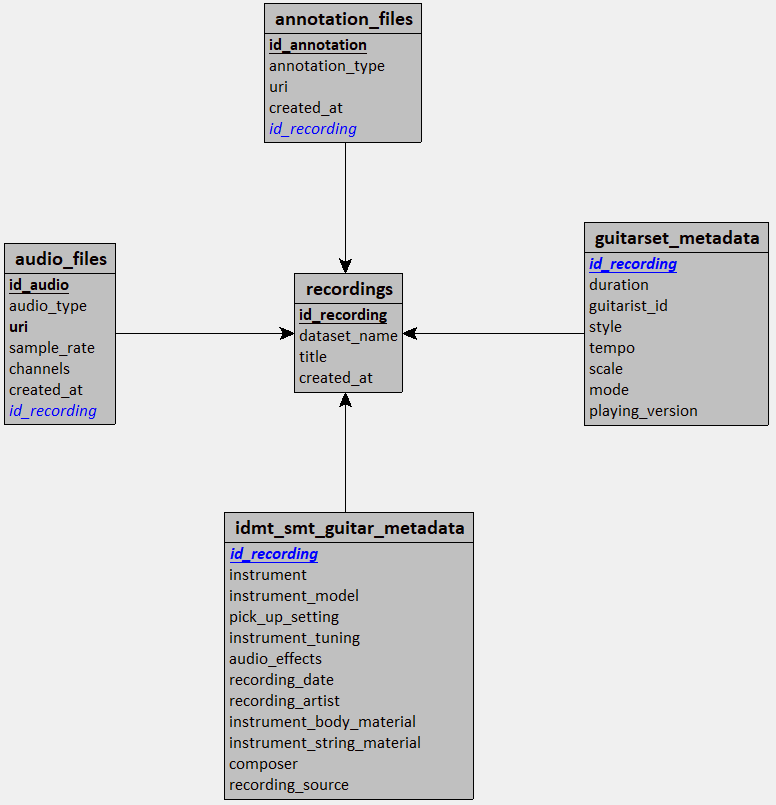

<h1>Livrable 1 : Infrastructure conceptualisée</h1>

Une étude de 1 page décrivant schématiquement l'infrastructure conceptualisée et le code source permettant de construire l'infrastructure.

# 1. Table des matières
- [1. Table des matières](#1-table-des-matières)
- [2. Introduction](#2-introduction)
  - [2.1. Context](#21-context)
  - [2.2. Objectif principal](#22-objectif-principal)
- [3. Exigences](#3-exigences)
  - [3.1. Exigences fonctionnelles](#31-exigences-fonctionnelles)
  - [3.2. Exigences non fonctionnelles](#32-exigences-non-fonctionnelles)
- [4. Architecture Globale](#4-architecture-globale)
  - [4.1. Choix d'architecture : Plateforme de données orientée Machine Learning](#41-choix-darchitecture--plateforme-de-données-orientée-machine-learning)
  - [4.2. Vue d’ensemble de l’architecture](#42-vue-densemble-de-larchitecture)
  - [4.3. Description des composants](#43-description-des-composants)
    - [4.3.1. Sources de données](#431-sources-de-données)
    - [4.3.2. Pipeline de téléchargement](#432-pipeline-de-téléchargement)
    - [4.3.3. Pipeline d'ingestion](#433-pipeline-dingestion)
    - [4.3.4. MinIO](#434-minio)
    - [4.3.5. MongoDB](#435-mongodb)
    - [4.3.6. PostgreSQL](#436-postgresql)
    - [4.3.7. Pipeline de preprocessing](#437-pipeline-de-preprocessing)
    - [4.3.8. Pipeline Machine Learning](#438-pipeline-machine-learning)
- [5. Justification des choix d’architecture](#5-justification-des-choix-darchitecture)
  - [5.1. Comparaison des architectures](#51-comparaison-des-architectures)
    - [5.1.1. Pourquoi pas un Data Lake ?](#511-pourquoi-pas-un-data-lake-)
    - [5.1.2. Pourquoi pas un Data Warehouse ?](#512-pourquoi-pas-un-data-warehouse-)
    - [5.1.3. Pourquoi pas un Data Lakehouse ?](#513-pourquoi-pas-un-data-lakehouse-)
    - [5.1.4. Avantages de la plateforme de données](#514-avantages-de-la-plateforme-de-données)
    - [5.1.5. Inconvénients de la plateforme de données](#515-inconvénients-de-la-plateforme-de-données)
  - [5.2. Justification du stockage polyglotte](#52-justification-du-stockage-polyglotte)
- [6. Choix des technologies](#6-choix-des-technologies)
  - [6.1. MinIO](#61-minio)
    - [6.1.1. Rôle](#611-rôle)
    - [6.1.2. Justification](#612-justification)
    - [6.1.3. Alternatives](#613-alternatives)
  - [6.2. MongoDB](#62-mongodb)
    - [6.2.1. Rôle](#621-rôle)
    - [6.2.2. Justification](#622-justification)
    - [6.2.3. Alternatives](#623-alternatives)
  - [6.3. PostgreSQL](#63-postgresql)
    - [6.3.1. Rôle](#631-rôle)
    - [6.3.2. Justification](#632-justification)
    - [6.3.3. Alternatives](#633-alternatives)
- [7. Flux de données](#7-flux-de-données)
- [8. Organisation des données](#8-organisation-des-données)
  - [8.1. Zones de données](#81-zones-de-données)
    - [8.1.1. Zone RAW](#811-zone-raw)
    - [8.1.2. Zone PROCESSING](#812-zone-processing)
    - [8.1.3. Zone OUTPUT](#813-zone-output)
  - [8.2. Convention de nommage](#82-convention-de-nommage)
  - [8.3. Métadonnées techniques](#83-métadonnées-techniques)
  - [8.4. Modélisation des données](#84-modélisation-des-données)
    - [8.4.1. Schéma entité-relation](#841-schéma-entité-relation)
  - [8.5. Flux de téléchargement](#85-flux-de-téléchargement)
  - [8.6. Flux d’ingestion](#86-flux-dingestion)
  - [8.7. Flux de preprocessing](#87-flux-de-preprocessing)
  - [8.8. Flux Machine Learning](#88-flux-machine-learning)
- [9. Sécurité et gouvernance](#9-sécurité-et-gouvernance)
  - [9.1. Gestion des accès](#91-gestion-des-accès)
  - [9.2. Intégrité des données](#92-intégrité-des-données)
  - [9.3. Traçabilité des pipelines](#93-traçabilité-des-pipelines)
- [10. Limites et évolutions](#10-limites-et-évolutions)
  - [10.1. Limites actuelles](#101-limites-actuelles)
  - [10.2. Évolutions possibles](#102-évolutions-possibles)

# 2. Introduction

## 2.1. Context

GuitarFlow souhaite développer une solution permettant de convertir automatiquement un enregistrement audio de guitare en fichier MIDI exploitable dans des logiciels de MAO.

Le projet est un Proof of Concept (POC) visant à automatiser les tâches de retranscription musicale afin de réduire le temps de traitement manuel et de faciliter la création de contenus pédagogiques et musicaux.

## 2.2. Objectif principal

L'objectif principale est de concevoir un système permettant :
- l’import d’un fichier audio guitare au format .wav,
- la génération d’un fichier MIDI,
- la visualisation des notes détectées sous forme de piano-roll,
- éventuellement la génération d'une partition ou d'une tablature,
- l’exposition du service via une API et une interface web.

# 3. Exigences

## 3.1. Exigences fonctionnelles

La plateforme d'entraînement doit permettre :
- le téléchargement automatisé des datasets,
- le stockage des fichiers audio et annotations,
- la normalisation et le nettoyage des fichiers audio,
- l’extraction de features audio,
- la génération d’un dataset frame-wise,
- l’entraînement de modèles Machine Learning,
- la génération de fichiers MIDI,
- le stockage des artefacts ML.

La platforme de service doit permettre :
- ...

## 3.2. Exigences non fonctionnelles

- Performance
- Scalabilité
- Maintenabilité
- Reproductibilité
- Disponibilité

# 4. Architecture Globale

## 4.1. Choix d'architecture : Plateforme de données orientée Machine Learning

L’architecture retenue est une plateforme de données orientée Machine Learning.

Cette architecture combine plusieurs technologies spécialisées afin d’optimiser les traitements selon la nature des données manipulées.

Le choix architectural repose sur les principes suivants :
- séparation des responsabilités,
- optimisation des performances selon les usages,
- modularité des pipelines,
- conservation des données brutes,
- flexibilité des métadonnées,
- reproductibilité des traitements ML.

L’architecture est organisée autour de trois couches principales :
- une couche de stockage objet pour les fichiers lourds,
- une couche documentaire pour les métadonnées flexibles,
- une couche relationnelle pour les données structurées.

## 4.2. Vue d’ensemble de l’architecture

L'architecture du projet est décrite par le schéma ci-dessous.
```txt

                                  ┌───────────────────────────────┐
                                  │ SOURCES                       │
                                  │                               │
                                  │ • GuitarSET                   │
                                  │ • IDMT-SMT-Guitar             │
                                  └───────────────┬───────────────┘
                                                  │
                                  ┌───────────────┴───────────────┐
                                  │ Download Pipeline (Python)    │
                                  │ local `./audio_midi/data`     │
                                  └───────────────┬───────────────┘
                                                  │
                                  ┌───────────────┴───────────────┐
                                  │ Ingestion Pipeline (Python)   │
                                  └───────────────┬───────────────┘
                                                  │
                ┌─────────────────────────────────┼──────────────────────────────────┐
                │                                 │                                  │
                ▼                                 ▼                                  ▼
┌───────────────────────────────┐ ┌───────────────────────────────┐ ┌───────────────────────────────┐
│ MinIO                         │ │ MongoDB                       │ │ PostgreSQL                    │
│ (Object Storage)              │ │ (Document Storage)            │ │ (SGBD)                        │
│                               │ │                               │ │                               │
│ Bucket: raw                   │ │ Collections:                  │ │ Tables:                       │
│ • annotations (.jams / .xml)  │ │ • note_midi                   │ │ • recordings                  │
│ • audios (.wav)               │ │                               │ │ • guitarset_metadata          │
│                               │ │                               │ │ • idmt_smt_guitar_metadata    │
│                               │ │                               │ │ • annotation_files            │
│                               │ │                               │ │ • audio_files                 │
└───────────────────────────────┘ └───────────────┬───────────────┘ └───────────────────────────────┘
                │                                 │
                └─────────────────────────────────┤
                                                  │
                                                  ▼
                                  ┌───────────────────────────────┐
                                  │ Preprocessing Pipeline        │
                                  │ (Python ou Spark)             │
                                  └───────────────┬───────────────┘
                                                  │
               ┌──────────────────────────────────┤
               │                                  │ 
               ▼                                  ▼ 
┌───────────────────────────────┐ ┌───────────────────────────────┐
│ MinIO                         │ │ MongoDB                       │
│ (Object Storage)              │ │ (Document Storage)            │
│                               │ │                               │
│ Bucket: processing            │ │ Collections:                  │
│ • audios cleaned and          │ │ • pipeline_metadata           │
│   normalized (.wav)           │ │ • sample_metadata             │
│ • samples: features and       │ │                               │
│   annotation (.parquet)       │ │                               │
└───────────────────────────────┘ └───────────────┬───────────────┘
                                                  │
                                                  ▼
                                  ┌───────────────────────────────┐
                                  │ ML Pipeline (Python)          │
                                  └───────────────┬───────────────┘
                                                  │
               ┌──────────────────────────────────┼─────────────────────────────────┐
               │                                  │                                 │
               ▼                                  ▼                                 ▼
┌───────────────────────────────┐ ┌───────────────────────────────┐ ┌───────────────────────────────┐
│ MinIO                         │ │ MongoDB                       │ │ PostgreSQL MLflow             │
│ (Object Storage)              │ │ (Document Storage)            │ │ (SGBD)                        │
│                               │ │                               │ │                               │
│ Bucket: output                │ │ Collections:                  │ │                               │
│ • artifacts (MLflow)          │ │ • dataset_metadata            │ │                               │
│ • MIDI (.midi)                │ │                               │ │                               │
└───────────────────────────────┘ └───────────────────────────────┘ └───────────────────────────────┘
```

## 4.3. Description des composants

### 4.3.1. Sources de données

Les datasets GuitarSet et IDMT-SMT-Guitar constituent les sources de données du projet.

| Source | Lien | Type | Volume estimé |
| :- | :- | :- | :- |
| GuitarSet | `https://zenodo.org/records/3371780` | API REST | 13.1 Go |
| IDMT-SMT-Guitar | `https://zenodo.org/records/7544110` | API REST | 1.84 Go |

Ces datasets contiennent :
- des fichiers audio au format WAV,
- des annotations musicales et métadonnées aux formats JAMS, XML, TXT et CSV.

### 4.3.2. Pipeline de téléchargement

Le pipeline de téléchargement est développé en Python et permet de télécharger localement les datasets.
Les archives sont téléchargées dans le dossier `audio_midi/data` puis décompressées automatiquement.

### 4.3.3. Pipeline d'ingestion

Le pipeline d'ingestion est développé en Python et permet le stockage initial des données.

### 4.3.4. MinIO

MinIO constitue le stockage principal de la plateforme.

Il est utilisé pour stocker :
- les données brutes,
- les données preprocessées,
- les datasets ML,
- les artefacts générés.

### 4.3.5. MongoDB

MongoDB est utilisé pour stocker les annotations et métadonnées semi-structurées.

La flexibilité du modèle documentaire facilite :
- le stockage des métadonnées variables,
- le suivi des pipelines,
- la gestion des informations liées aux samples.

### 4.3.6. PostgreSQL

PostgreSQL constitue la source de vérité relationnelle du système.

Il permet de stocker :
- les données structurées,
- les relations entre fichiers,
- les métadonnées référentielles.

### 4.3.7. Pipeline de preprocessing

Le pipeline de preprocessing est développé principalement en Python.

Une évolution vers Spark est envisagée pour certains traitements distribués.

Les traitements réalisés incluent :
- le nettoyage audio,
- la normalisation,
- l’extraction des features,
- la construction du dataset frame-wise.

### 4.3.8. Pipeline Machine Learning

Le pipeline Machine Learning utilise TensorFlow et scikit-learn.

Il permet :
- l’entraînement des modèles,
- l’évaluation,
- la génération des fichiers MIDI,
- le stockage des artefacts MLflow.

# 5. Justification des choix d’architecture

## 5.1. Comparaison des architectures

| Critère | Data Lake | Data Warehouse | Data Lakehouse | Data Platform |
| :- | :- | :- | :- | :- |
| Type de données | Non structurées | Structurées | Hybrides | Hybrides |
| Flexibilité | Élevée | Faible | Moyenne | Élevée |
| Usage ML | Bon | Limité | Bon | Excellent |
| Évolution des schémas | Flexible | Rigide | Flexible | Flexible |
| Stockage multi-technologies | Non | Non | Partiel | Oui |
| Adapté au preprocessing audio | Oui | Non | Oui | Oui |
| Adapté aux pipelines ML | Partiellement | Non | Oui | Oui |

### 5.1.1. Pourquoi pas un Data Lake ?

Une architecture Data Lake pure n’a pas été retenue car le projet nécessite également :
- des relations structurées,
- des métadonnées flexibles,
- plusieurs types de stockage spécialisés.

### 5.1.2. Pourquoi pas un Data Warehouse ?

Le projet est orienté traitement Machine Learning et non Business Intelligence.
Les schémas de données évoluent régulièrement durant les expérimentations.
Une architecture Data Warehouse aurait introduit une rigidité incompatible avec les besoins de preprocessing et de feature engineering.

### 5.1.3. Pourquoi pas un Data Lakehouse ?

Une architecture Lakehouse complète nécessiterait :
- une couche transactionnelle,
- des formats de table spécialisés,
- des moteurs analytiques supplémentaires.

Cette complexité n’est pas justifiée dans le cadre du projet.

### 5.1.4. Avantages de la plateforme de données

L’architecture retenue présente plusieurs avantages :
- séparation claire des responsabilités,
- optimisation des performances selon les usages,
- modularité des pipelines,
- flexibilité des métadonnées,
- bonne adaptation aux workflows ML,
- facilité d’évolution.

### 5.1.5. Inconvénients de la plateforme de données

Cette architecture présente également certaines limites :
- multiplication des technologies,
- complexité opérationnelle plus importante,
- absence de gouvernance centralisée,
- absence de mécanismes avancés de versionning.

## 5.2. Justification du stockage polyglotte

Le choix du stockage polyglotte permet d’utiliser chaque technologie selon son domaine d’excellence.

MinIO est utilisé pour le stockage massif de fichiers audio.

MongoDB est utilisé pour les métadonnées dynamiques et semi-structurées.

PostgreSQL est utilisé pour les données relationnelles nécessitant intégrité et cohérence.

Cette approche améliore les performances.

# 6. Choix des technologies

## 6.1. MinIO

### 6.1.1. Rôle

Stockage objet principal de la plateforme.

### 6.1.2. Justification

MinIO a été retenu car il :
- est open source,
- est compatible S3,
- s’intègre facilement avec Docker Compose,
- est adapté aux fichiers volumineux.

### 6.1.3. Alternatives

- AWS S3

## 6.2. MongoDB

### 6.2.1. Rôle

Stockage documentaire des annotations et métadonnées.

### 6.2.2. Justification

MongoDB a été retenu pour :
- sa flexibilité de schéma,
- sa capacité à stocker des documents semi-structurés,
- la gestion des métadonnées variables,
- la simplicité d’évolution des structures.

### 6.2.3. Alternatives

- MinIO pour les annotations
- PostgreSQL pour les métadatas

## 6.3. PostgreSQL

### 6.3.1. Rôle

Base relationnelle principale et source de vérité du système.

### 6.3.2. Justification

PostgreSQL a été retenu pour :
- sa robustesse,
- son support SQL,
- l’intégrité référentielle,
- la gestion des relations structurées.

### 6.3.3. Alternatives

- MySQL

# 7. Flux de données

# 8. Organisation des données

## 8.1. Zones de données

L’architecture est organisée en trois zones principales.

### 8.1.1. Zone RAW

La zone RAW contient les données brutes téléchargées depuis les datasets.

Cette zone garantit la conservation des données originales.

### 8.1.2. Zone PROCESSING

La zone PROCESSING contient les données transformées et enrichies.

Cette zone inclut :
- les audios normalisés et nétoyées,
- les datasets frame-wise.

Les données sont stockées au format Parquet afin d’optimiser les traitements.

### 8.1.3. Zone OUTPUT

La zone OUTPUT contient les résultats des pipelines ML.

Cette zone inclut :
- les fichiers MIDI,
- les artefacts MLflow,
- les résultats d’expérimentation.

## 8.2. Convention de nommage

| Elément | Convention | Exemple |
| :- | :- | :- |
| GuitarSet Audio Raw | minio://raw/GuitarSet/{title}/{audio_type}.wav | minio://raw/GuitarSet/00_BN1-129-Eb_comp/audio_hex-pickup_debleeded.wav |
| GuitarSet Annotation Raw | minio://raw/GuitarSet/{title}/annotation.jams | minio://raw/GuitarSet/00_BN1-129-Eb_comp/annotation.jams |
| IDMT-SMT-Guitar Audio Raw | minio://raw/IDMT-SMT-Guitar_{dataset_number}/{title}/audio.wav | minio://raw/IDMT-SMT-Guitar_1/G53-40100-1111-00001/audio.wav |
| GuitarSet Annotation Raw | minio://raw/IDMT-SMT-Guitar_{dataset_number}/{title}/annotation.xml | minio://raw/IDMT-SMT-Guitar_1/G53-40100-1111-00001/annotation.xml |
| Audio Processed | ? | ? |
| Sample | ? | ? |

## 8.3. Métadonnées techniques

Métadata du pipeline e prétraitement :
```python
{
    "normalization": {
        "norm_type": "peak+rms",
        "target_rms": 0.1,
        "target_peak": 1.0,
        "target_sample_rate": 22050,
    },
    "cleaning": {
        "use_highpass": False,
        "highpass_cutoff": 80.0,
        "use_lowpass": False,
        "lowpass_cutoff": 8000.0,
        "use_wiener": False,
        "wiener_strength": 1.0,
        "use_spectral_denoise": False,
        "use_trim": False,
        "trim_db": 40.0,
    },
    "feature_selection": {
        "use_stft": False,
        "use_mel": False,
        "use_cqt": True,
        "use_chroma": False,
        "use_mfcc": False,
    },
    "feature_parameters": {
        "n_fft": 2048,
        "hop_length": 512,
        "n_mels": 128,
        "n_mfcc": 13,
        "fmin": librosa.note_to_hz("E2"),
        "n_cqt_bins": 84,
        "bins_per_octave": 12,
    },
    "piano_roll": {
        "midi_min": 36,
        "midi_max": 99,
    },
}
```

Métadata du pipeline construction de dataset :
```python
{
    "dataset_name": "frame-wise",
    "datasets_used": {
        "use_guitarset": True,
        "use_idmt_smt_guitar": False,
    },
    "max_samples_per_datasets": None,
    "preprocessing_pipeline_id": "UUID",
    "split_train_test_validation": {
        "train_size": 0.7,
        "val_size": 0.1,
        "test_size": 0.2,
        "random_state": 42,
        "shuffle": True,
    },
    "split_features_target": {
        "prefix_features": ("cqt_",),
        "prefix_target": ("pitch_",),
    },
    "context_window": {
        "use_context_window": False,
        "context_size": 11,
    },
    "datasets_objects_names": {
        "train_objects_names": [],
        "train_samples": [],
        "validation_objects_names": [],
        "validation_samples": [],
        "test_objects_names": [],
        "test_samples": [],
    },
}
```

## 8.4. Modélisation des données

### 8.4.1. Schéma entité-relation



## 8.5. Flux de téléchargement

Le pipeline de téléchargement télécharge les datasets localement dans le dossier `./audio_midi/data`.

## 8.6. Flux d’ingestion

Le pipeline d'ingestion :
- stocke les données brutes dans MinIO,
- extrait les annotations vers MongoDB,
- extrait les métadonnées vers PostgreSQL.

## 8.7. Flux de preprocessing

Le pipeline de preprocessing :
- lit les fichiers audio depuis MinIO,
- applique les traitements audio,
- extrait les features,
- génère les datasets frame-wise,
- stocke les résultats dans la zone PROCESSING.

## 8.8. Flux Machine Learning

Le pipeline Machine Learning :
- charge les datasets preprocessés,
- entraîne les modèles,
- stocke les artefacts MLflow,
- stocke les métriques dans PostgreSQL.

# 9. Sécurité et gouvernance

## 9.1. Gestion des accès

Le projet étant un POC, aucun mécanisme avancé de sécurité n’est actuellement implémenté.

Les accès reposent principalement sur la configuration locale Docker Compose.

## 9.2. Intégrité des données

Les données brutes sont conservées dans une zone RAW dédiée afin de garantir leur intégrité.

Les différentes étapes de transformation sont séparées pour limiter les risques de corruption des données sources.

## 9.3. Traçabilité des pipelines

La traçabilité repose principalement sur :
- les métadonnées MongoDB,
- les artefacts MLflow,
- l’organisation des zones de stockage.

Aucun mécanisme avancé de versionning n’est actuellement implémenté.

# 10. Limites et évolutions

## 10.1. Limites actuelles

Les principales limites de l’architecture sont :
- absence de haute disponibilité,
- absence de stratégie de sauvegarde,
- absence de sécurité avancée,
- absence de versionning des datasets,
- exécution locale uniquement,
- architecture non distribuée.

## 10.2. Évolutions possibles

Les évolutions futures envisagées sont :
- ajout d’un orchestrateur de pipelines,
- intégration de Spark pour les traitements distribués,
- migration vers une architecture Lakehouse,
- déploiement cloud,
- ajout d’un système de monitoring.