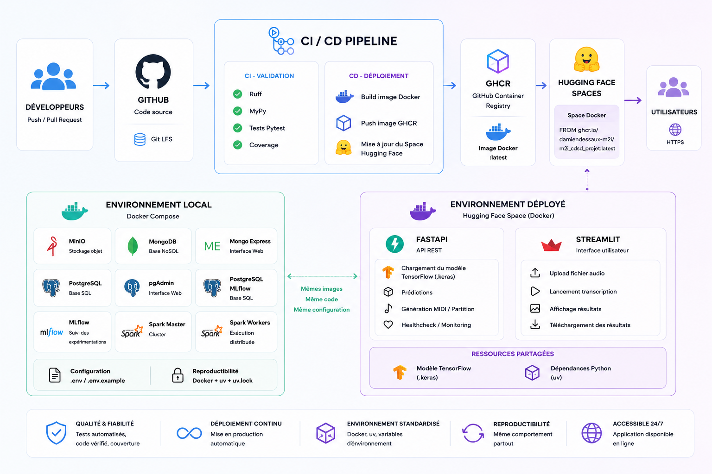

<h1>Livrable 5 : Industrialisation et optimisation des processus</h1>

# 1. Table des matières
- [1. Table des matières](#1-table-des-matières)
- [2. Objectif du livrable](#2-objectif-du-livrable)
- [3. Architecture générale](#3-architecture-générale)
- [4. Environnement standardisé](#4-environnement-standardisé)
- [5. Déploiement de l'algorithme](#5-déploiement-de-lalgorithme)
- [6. API de production](#6-api-de-production)
- [7. Interface utilisateur](#7-interface-utilisateur)
- [8. Conteneurisation](#8-conteneurisation)
- [9. Déploiement local](#9-déploiement-local)
- [10. Intégration continue (CI)](#10-intégration-continue-ci)
  - [10.1. Validation du code](#101-validation-du-code)
  - [10.2. Validation fonctionnelle](#102-validation-fonctionnelle)
  - [10.3. Mesure de qualité](#103-mesure-de-qualité)
- [11. Livraison continue (CD)](#11-livraison-continue-cd)
- [12. Gestion des dépendances](#12-gestion-des-dépendances)
- [13. Ressources du projet](#13-ressources-du-projet)
  - [13.1. Dépôt GitHub](#131-dépôt-github)
  - [13.2. Application déployée](#132-application-déployée)
- [14. Conclusion](#14-conclusion)
  - [14.1 Figure d'architecture CICD et déploiement](#141-figure-darchitecture-cicd-et-déploiement)

# 2. Objectif du livrable

Ce document présente les éléments permettant de démontrer l'industrialisation et le déploiement de l'application.

Le projet est composé :

- d'une API REST FastAPI,
- d'une interface utilisateur Streamlit,
- d'un modèle TensorFlow chargé au démarrage de l'API,
- d'une chaîne CI/CD GitHub Actions,
- d'un déploiement automatisé sur Hugging Face Spaces,
- d'un environnement Docker entièrement reproductible.

# 3. Architecture générale

```
                      GitHub
                         │
                         │ push [main]
                         ▼
                 GitHub Actions CI/CD
                         │
            ┌────────────┴────────────┐
            │                         │
            ▼                         ▼
 Validation fonctionelle      Validation du code
  Tests / Coverage 20%           Ruff / MyPy
            │                         │
            └────────────┬────────────┘
                         │
                         ▼
                    Image Docker
                  publiée sur GHCR
                         │
                         ▼
                Déploiement automatique
                  Hugging Face Spaces
                         │
                         ▼
             Streamlit + FastAPI + TensorFlow
```

# 4. Environnement standardisé

L'ensemble du projet est conteneurisé avec **Docker**.

Les dépendances Python sont gérées par **uv** afin de garantir :

- la reproductibilité de l'environnement,
- le verrouillage des versions (`uv.lock`),
- une installation identique entre le développement, la CI et la production.

Les dépendances sont décrites dans :

- `pyproject.toml` 
- `uv.lock`

Le conteneur principal embarque :

- Python 3.13
- FastAPI
- Streamlit
- TensorFlow
- music21
- Verovio
- CairoSVG

Le script `start.sh` démarre simultanément :

- l'API FastAPI ;
- l'interface Streamlit.

# 5. Déploiement de l'algorithme

Le modèle d'apprentissage est développé indépendamment de l'API.

Le cycle est le suivant :

1. création des datasets,
2. entraînement du modèle,
3. suivi des expérimentations avec MLflow,
4. export du meilleur modèle TensorFlow (`.keras`) ou scikit-learn (`.joblib`),
5. intégration du modèle dans l'API,
6. chargement unique du modèle au démarrage.

L'API ne réalise aucun entraînement.

Elle ne réalise que :

- le chargement du modèle,
- le prétraitement audio,
- l'extraction des features de machine-learning,
- l'inférence,
- le post-traitement,
- la génération des fichiers MIDI et partition.

# 6. API de production

L'API est développée avec **FastAPI**.

Elle expose notamment :

- `/health`
- `/model`
- `/predict`
- `/artifact`

Les réponses sont standardisées au travers d'un modèle générique :

- `ApiResponse<T>`

Les erreurs sont centralisées via des gestionnaires d'exceptions dédiés.

Le modèle TensorFlow est partagé entre toutes les requêtes grâce au cycle de vie (`lifespan`) de FastAPI.

# 7. Interface utilisateur

L'application utilisateur est développée avec **Streamlit**.

Elle communique exclusivement avec l'API REST.

Elle permet :

- le dépôt d'un fichier WAV,
- le lancement de la transcription,
- l'affichage des résultats,
- le téléchargement des artefacts générés.

# 8. Conteneurisation

Le projet est distribué sous forme d'image Docker.

Le conteneur contient :

- FastAPI
- Streamlit
- le modèle TensorFlow
- les dépendances Python
- les bibliothèques système nécessaires.

Le même conteneur est utilisé :

- en développement,
- dans GitHub Actions,
- sur Hugging Face Spaces.

Cette approche garantit un comportement identique sur tous les environnements.

# 9. Déploiement local

Le projet peut être lancé intégralement avec :

```bash
docker compose up --build
```

Le fichier `docker-compose.yml` déploie :

- API FastAPI
- Streamlit
- MinIO
- MongoDB
- Mongo Express
- PostgreSQL
- pgAdmin
- PostgreSQL MLflow
- MLflow
- Spark Master
- Spark Workers

L'ensemble des paramètres est externalisé dans un fichier `.env`.

Un fichier `.env.example` est fourni afin de reproduire facilement l'environnement.

# 10. Intégration continue (CI)

Chaque Push ou Pull Request déclenche automatiquement GitHub Actions.

La chaîne CI réalise :

## 10.1. Validation du code

- Ruff
- MyPy

## 10.2. Validation fonctionnelle

- exécution des tests Pytest

## 10.3. Mesure de qualité

- génération du rapport Coverage
- vérification d'un seuil minimal de couverture

Les rapports de couverture sont publiés comme artefacts GitHub Actions.

# 11. Livraison continue (CD)

Après validation de la qualité du code :

1. construction de l'image Docker,
2. publication dans GitHub Container Registry (GHCR),
3. mise à jour automatique du Dockerfile du Space Hugging Face,
4. déploiement automatique de la nouvelle version.

Le Space Hugging Face exécute directement la dernière image Docker publiée.

# 12. Gestion des dépendances

Le projet utilise :

- `uv`
- `pyproject.toml`
- `uv.lock`

afin d'assurer :

- la reproductibilité,
- le verrouillage des versions,
- une installation déterministe.

# 13. Ressources du projet

## 13.1. Dépôt GitHub

https://github.com/DamienDESSAUX-M2i/M2i_CDSD_Projet

## 13.2. Application déployée

https://huggingface.co/spaces/DamienDESSAUX/M2i_CDSD_Projet_Deployment

# 14. Conclusion

Le projet met en œuvre une chaîne complète d'industrialisation.
L'environnement est entièrement reproductible, les contrôles qualité sont automatisés, le déploiement est continu et l'application est disponible publiquement via Hugging Face Spaces.

## 14.1 Figure d'architecture CICD et déploiement


